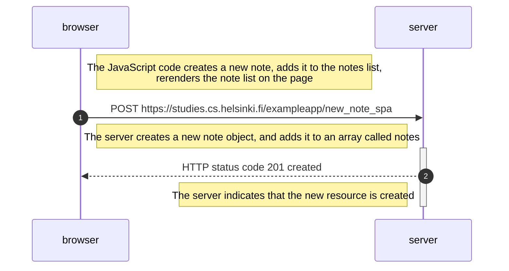

```mermaid
sequenceDiagram
autonumber
    participant browser
    participant server
	Note right of browser: The JavaScript code creates a new note, adds it to the notes list, <br> rerenders the note list on the page
    browser->>server: POST https://studies.cs.helsinki.fi/exampleapp/new_note_spa
    Note left of server: The server creates a new note object, and adds it to an array called notes
    activate server
    server-->>browser: HTTP status code 201 created
    Note left of server: The server indicates that the new resource is created
    deactivate server
```